# Blackjack
## Index - Table Of Contents
1. [General Information](#general-info)
2. [User Experience & Design](#ux)
3. [Features](#features)
4. [Technologies Used](#tech-used)
5. [Testing](#testing)
6. [Deployment](#deployment)

## General Information

This is a simple blackjack game. This python game has all the attributes of the classic card game.  It uses decks of 52 cards, four suits, with the typical shuffle card technique, instructions and score board, this game envokes the quintessential casino game. The player plays against the computer/dealer with the strategy to beat the dealer's hand without going over 21.

 [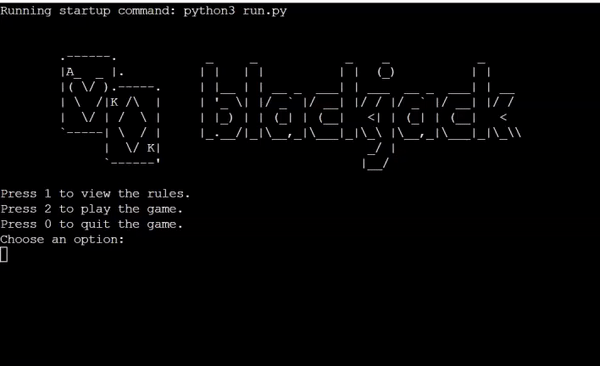

## User Experience

**Site Goals**

1. As A User
* I would like to be able to access the game instructions upon opening the game.
* I would like to be able to easily differentiate between card suits.
* I would like to have the option to take more cards if I wanted to.
* I would like to be able to see the user score and computer score once the game is over.
* I would like the game to run smoothly and without errors.

2. As The Site Administrator
* I want the game to have simple, straightforward navigation.
* I want the game to be easy to use.
* I want the blackjack game to mimic all the characteristics of the classic game.

## Design

*Color Scheme*

* When designing this project, my main focus with the color scheme was easy readability. I wanted the users to clearly differentiate between the player and computer hands. I decided to use red and green as they are opposite each other on the colour wheel and are highly contrasting.

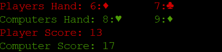

* The questions that are asked to the user are printed in blue text. The blue stands out from the red and green. It makes the questions easy to decipher from the rest of the text and the user is automatically drawn to the blue text and to answer the question as a result.

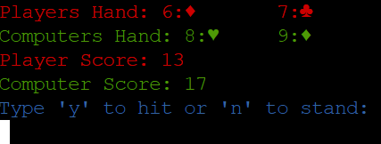

* When the game computes the winner, the text appears in a bright yellow shade. It is akin to gold, synonymous with winning. It draws in the user immediately as it is brighter than the other colours.

*Flowchart*

* The structural design element of the app was defined and mapped out on a flow chart. The flow chart helped to give a visual representation of the sequence of steps and decisions needed to perform the creative process. It communicated the steps of the process very effectively and efficiently.

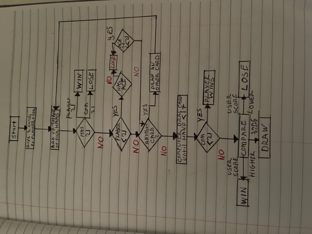

*Game Logo*

* Upon opening the app, you are immediately greeted with the game logo. It has the blackjack text and the two subsequent cards. It gives the user immediate insight and understanding as to what the game is about. It is simple yet effective.

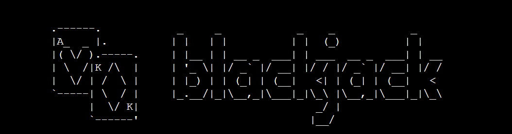

*Suit Symbols*

* The suit symbols were used to more easily decipher the given card suits. I originally had letters for the suits, eg. H for Hearts. It was not good for legibility and I found myself having to stop and think as to what the suit might be. With the symbols it's so much more clearer and enjoyable for the playing user.

## Features

*Game Menu*

The game menu is immediately accessible upon opeing the app. It gives the user three options - to view the game rules, to play the game and to quit the game. The user simply has to press the coinciding digit and press enter to make their choice. It's straightforward and easy to understand.

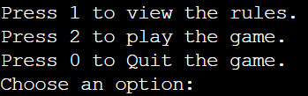

*Rules*

There are 13 game rules that the user can follow to get the jist of the blackjack game. The built in open function is used to access and read the rules.txt file.

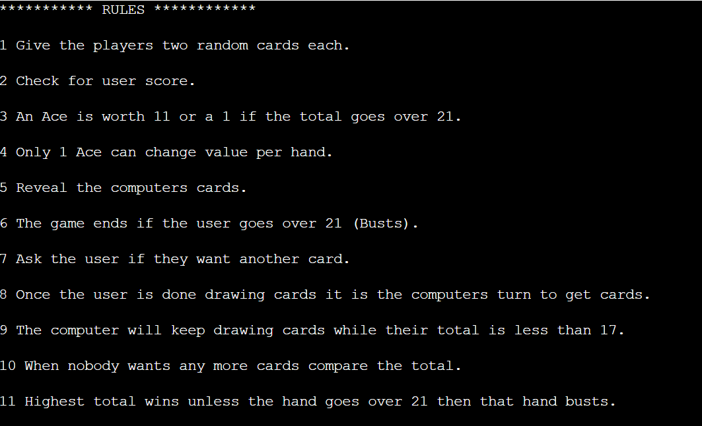

### PEP 8 Style Guide
 
 The PEP 8 style guidlines were implemented throughout this project.

* Following the ASCII compatability standard, identifiers use Latin letters only.

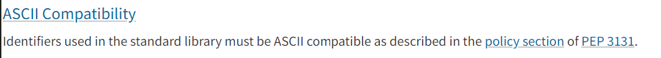

* All class names as seen in this project use the CapWords convention, for example the Card, Hand and Deck class names. All function names are lowercase with words separated by underscores as necessary to improve readability, such as return_card_value, hand_total, create_deck, show_rules, and many more.

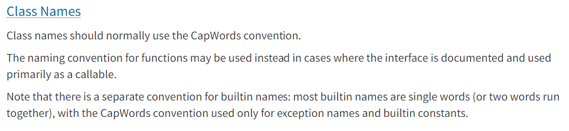

* Every constant in the run.py file follows the pep8 contants guidelines, written in all capitals and separated by underscores for easy reading. For example, RANKS, SUITS, NUMBER_VALUE and ACE_VALUE.

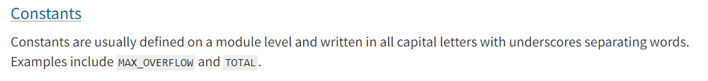

* Correct use of whitespace as per the PEP8 guidelines can be seen in the NUMBER_VALUE dictionary.

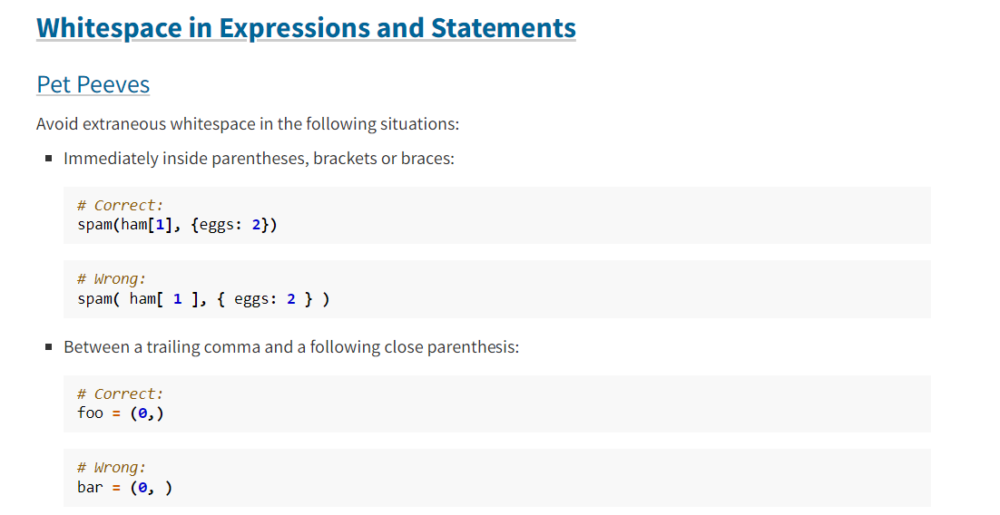

### Object Oriented Programming

* OOP was implemented in this project. The Deck class is a derived/child class of the Hand class. By using this python inheritance, I could use the details of the existing parent class without modifying it.

## Technologies Used

**Frameworks, Libraries & Programs Used**

* [The blackjack logo came from ascii art](https://www.asciiart.eu/)

* I referred to the book Python Programming Third Edition by Michael Dawson, Chapter 9, for inspiration on how to create the Card class and the ask_yes_no function.

* [The blackjack gif was created using ezgif](https://ezgif.com/maker)

## Testing

**Functional Testing**

*Card Class*

* Testing was ran on the card class to ensure it does it's intended task - creates the suits and ranks, implements the suit symbols and assigns the cards to their number value. This was assessed by creating two card variables and assigning each a specific rank and suit. The cards were then printed using the print statement. To test the return card value function, I assigned each card the function using dot notation and printed them.

* The card class worked as intended.

*Hand Class*

* Testing was carried out on the hand class to make sure the functions work in the correct fashion - give cards to each player, empty the deck at the beginning of each game and return the total value of cards in a players hand. To test, I assigned a my_hand identifier to the hand class. Using dot notation I added both test cards to the newly created hand identifier. Using print, I checked the terminal to see that both cards were now present in the hand. Afterwards I made a new variable to test the hand_total function, assigning it the my_hand identifier and the hand_total() function using dot notation.

* The hand class worked as intended.

*Deck Class*

* Testing was done on the deck class to ensure it was working perfectly - creating a full deck of playing cards, looping through the suits and ranks and creating cards accordingly, shuffling the cards and lastly dealing the cards in the appropriate fashion. I created a deck identifier and assigned it the deck class. The identifier accessed the create_deck method using dot notation and was printed to the terminal. To test the shuffle function I used dot notation again to ingress the shuffle method, and used the print statement.

* The deck class worked as intended.

*Rules.txt*

* Testing was carried out on the rules text file to ensure the game rules were accessible to the player. This was done by calling the show_rules method.

* The rules.txt file worked as intended.

*Play Game Function*

* This function was tested to verify it was running effectively - allowing the user to play the card game against the computer, flagging the end of the game, creating hands for both the player and the computer, dealing cards to the player and the computer, getting player and computer hand totals, adding inputs for the user to take or refuse a card, ending the game if the card hand total is over 21 and creating the computers moves. 

To test it's functionality, I began with the blackjack_deck identiifier accessing the deal method using dot notation, and passing in the recently created players identifier and the number 2 as arguments in the parentheses. By printing the player hand and the computer hand identifiers, I could easily analyse the code result in the terminal.

I had to check the player score's and computer score's viability. I created identifiers of the same name and assigned them to the player/computer hand, which were then appeneded to the hand total function. I subsequently printed both player and computer score identifiers.

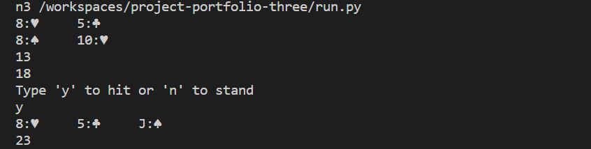

The first while loop had to be assessed too. To achieve this I printed the player hand and player score and the same for the computer hand and score.

When the final while loop was done and the entirety of the function was completed I did the final analysis. I repeated the print steps for the previous while loop.

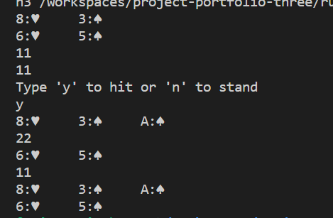

## Deployment

**Version Control**

The site was created using the Code Anywhere code editor and pushed to github to the remote repository "project-portfolio-three".

The following git commands were used throughout development to push code to the remote repo:

git status - This command was used to check which files were modified.

git add . - This command was used to add the changed files to the staging area before they are committed.

git commit -m "commit message" - This command was used to commit changes to the local repository queue ready for the final step.

git push - This command was used to push all committed code to the remote repository on github.

touch - This command was used to create new files.

**Heroku Deployment**

To deploy the project to Heroku the following steps were implemented:

1. Log in to Heroku and click "New" to create a new app.
2. Choose an app name and region, then click "Create app".
3. Go to "Settings" and navigate to Config Vars. Add PORT 8000.
4. Navigate to Buildpacks and add buildpacks for Python and NodeJS, ensuring they are strictly in that order.
5. Navigate to the "Deploy" section. Set the deployment method to Github and enter the chosen repository name and then connect.
6. Scroll down the page, click Automatic Deploy, select "main" branch and click "Deploy Branch".
7. The app will now be deployed to heroku.

